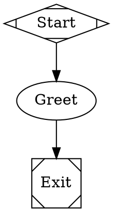
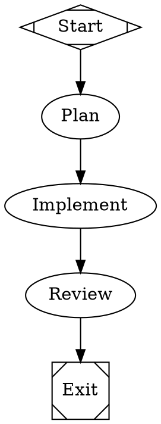
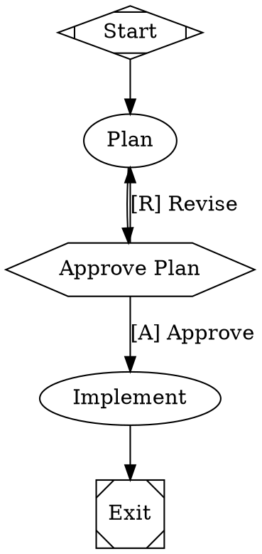
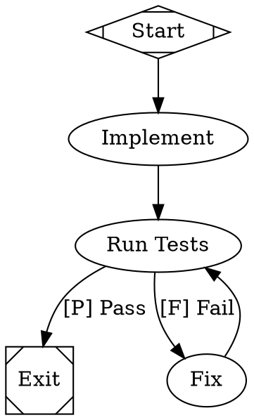
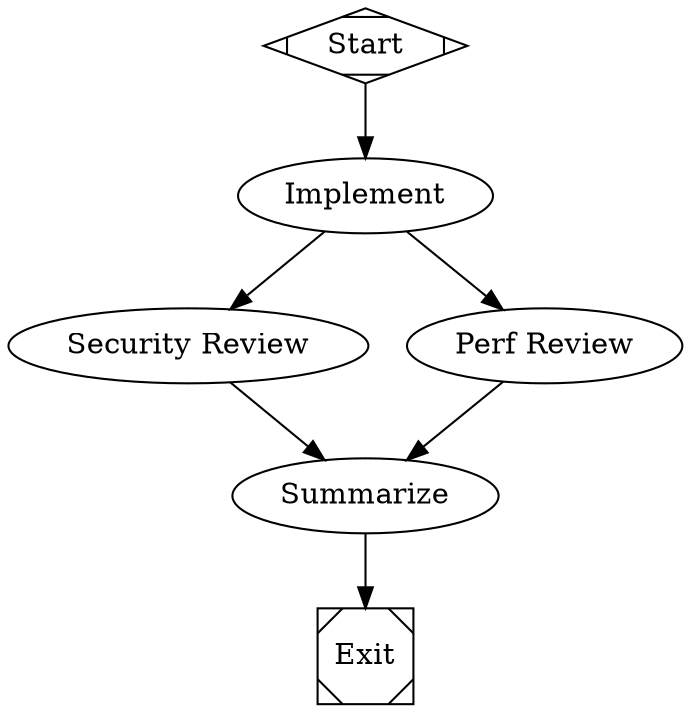
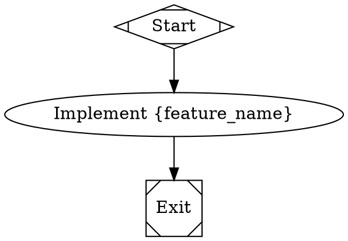
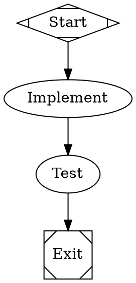
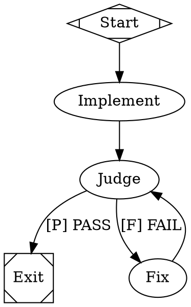
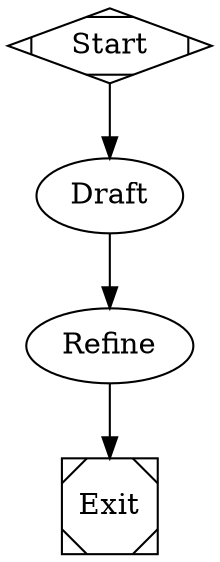

# Fabro Workflow Factory

> Skill by [ara.so](https://ara.so) — Daily 2026 Skills collection.

Fabro is an open source AI coding workflow orchestrator written in Rust. It lets you define agent pipelines as Graphviz DOT graphs — with branching, loops, human approval gates, multi-model routing, and cloud sandbox execution — then run them as a persistent service. You define the process; agents execute it; you intervene only where it matters.

---

## Installation

```bash
# Via Claude Code (recommended)
curl -fsSL https://fabro.sh/install.md | claude

# Via Codex
codex "$(curl -fsSL https://fabro.sh/install.md)"

# Via Bash
curl -fsSL https://fabro.sh/install.sh | bash
```

After installation, run one-time setup and per-project initialization:

```bash
fabro install      # global one-time setup
cd my-project
fabro init         # per-project setup (creates .fabro/ config)
```

---

## Key CLI Commands

```bash
# Workflow management
fabro run <workflow.dot>          # execute a workflow
fabro run <workflow.dot> --watch  # stream live output
fabro runs                        # list all runs
fabro runs show <run-id>          # inspect a specific run

# Human-in-the-loop
fabro approve <run-id>            # approve a pending gate
fabro reject <run-id>             # reject / revise a pending gate

# Sandbox access
fabro ssh <run-id>                # shell into a running sandbox
fabro preview <run-id> <port>     # expose a sandbox port locally

# Retrospectives
fabro retro <run-id>              # view run retrospective (cost, duration, narrative)

# Config
fabro config                      # view current configuration
fabro config set <key> <value>    # set a config value
```

---

## Workflow Definition (Graphviz DOT)

Workflows are `.dot` files using the Graphviz DOT language with Fabro-specific attributes.

### Node Types

| Shape | Meaning |
|---|---|
| `Mdiamond` | Start node |
| `Msquare` | Exit node |
| `rectangle` (default) | Agent node (LLM turn) |
| `hexagon` | Human gate (pauses for approval) |

### Minimal Hello World



```bash
fabro run hello.dot
```

---

## Multi-Model Routing with Stylesheets

Fabro uses CSS-like `model_stylesheet` declarations on the graph to route nodes to models. Use classes to target groups of nodes.



### Supported Model Stylesheet Properties

```
model: <model-id>           # e.g. claude-sonnet-4-5, gpt-4o, gemini-2-flash
reasoning_effort: low|medium|high
provider: anthropic|openai|google
```

---

## Human Gates (Approval Nodes)

Use `shape=hexagon` to pause execution for human approval. Transitions are labeled with `[A]` (approve) and `[R]` (revise/reject).



Approve or reject from the CLI:

```bash
fabro runs                          # find the paused run-id
fabro approve <run-id>              # continue with implementation
fabro reject <run-id> --note "Add error handling to the plan"
```

---

## Loops and Fix Cycles

Use labeled transitions to build automatic retry/fix loops:



---

## Parallel Nodes

Run multiple agent nodes concurrently by forking edges from a single source:



---

## Variables and Dynamic Prompts

Use `{variable}` interpolation in prompts. Pass variables at run time:



```bash
fabro run feature.dot --var feature_name=oauth-login
```

---

## Cloud Sandboxes (Daytona)

To run agents in isolated cloud VMs instead of locally, configure a Daytona sandbox:

```bash
fabro config set sandbox.provider daytona
fabro config set sandbox.api_key $DAYTONA_API_KEY
fabro config set sandbox.region us-east-1
```

Then add sandbox config to your workflow graph:



```bash
fabro run sandboxed.dot          # spins up cloud VM, runs workflow, tears it down
fabro ssh <run-id>               # shell into the running sandbox for debugging
fabro preview <run-id> 3000      # forward sandbox port 3000 locally
```

---

## Git Checkpointing

Fabro automatically commits code changes and execution metadata to Git branches at each stage. To inspect or resume:

```bash
fabro runs show <run-id>         # see branch names per stage
git checkout fabro/<run-id>/implement   # inspect the code at a specific stage
git diff fabro/<run-id>/plan fabro/<run-id>/implement  # diff between stages
```

---

## Retrospectives

After every run, Fabro generates a retrospective with cost, duration, files changed, and an LLM-written narrative:

```bash
fabro retro <run-id>
```

Example output:

```
Run: implement-oauth-2024
Duration:  4m 32s
Cost:      $0.043
Files:     src/auth.rs (+142), src/lib.rs (+8), tests/auth_test.rs (+67)

Narrative:
  The agent successfully implemented OAuth2 PKCE flow. It created the auth
  module, integrated with the existing middleware, and added integration tests.
  One fix loop was needed after the token refresh test failed.
```

---

## REST API and SSE Streaming

Fabro runs an API server for programmatic use:

```bash
fabro serve --port 8080
```

### Trigger a run via API

```bash
curl -X POST http://localhost:8080/api/runs \
  -H "Content-Type: application/json" \
  -d '{
    "workflow": "workflows/plan-implement.dot",
    "variables": { "feature_name": "dark-mode" }
  }'
```

### Stream run events via SSE

```bash
curl -N http://localhost:8080/api/runs/<run-id>/events
```

### Approve a gate via API

```bash
curl -X POST http://localhost:8080/api/runs/<run-id>/approve \
  -H "Content-Type: application/json" \
  -d '{ "decision": "approve" }'
```

---

## Environment Variables

```bash
# Required — at least one LLM provider key
export ANTHROPIC_API_KEY=...
export OPENAI_API_KEY=...
export GOOGLE_API_KEY=...

# Optional — cloud sandboxes
export DAYTONA_API_KEY=...

# Optional — Fabro API server auth
export FABRO_API_TOKEN=...
```

---

## Project Structure Convention

```
my-project/
├── .fabro/               # Fabro config (created by `fabro init`)
│   └── config.toml
├── workflows/            # Your DOT workflow definitions
│   ├── plan-implement.dot
│   ├── fix-loop.dot
│   └── ensemble-review.dot
├── specs/                # Natural language specs referenced by prompts
│   └── feature-name.md
└── src/                  # Your actual source code
```

---

## Common Patterns

### Pattern: Spec-driven implementation



### Pattern: Cheap draft, expensive refine



---

## Troubleshooting

**`fabro: command not found`**
- Re-run the install script and ensure `~/.local/bin` (or the install prefix) is on your `$PATH`.
- Try `source ~/.bashrc` or `source ~/.zshrc` after installation.

**Agent gets stuck in a loop**
- Add a maximum iteration guard: use a counter variable and a conditional transition to force exit after N iterations.
- Check your prompt — ambiguous exit conditions cause looping.

**Human gate never pauses**
- Confirm the node uses `shape=hexagon`, not just a label containing "approve".
- Check `fabro runs show <run-id>` to confirm the run reached that node.

**Sandbox fails to start**
- Verify `DAYTONA_API_KEY` is set and valid.
- Run `fabro config` to confirm `sandbox.provider` is set to `daytona`.
- Check `fabro runs show <run-id>` for sandbox error details.

**Model not found / API error**
- Ensure the correct provider API key is exported (`ANTHROPIC_API_KEY`, `OPENAI_API_KEY`, etc.).
- Check the `model:` value in your stylesheet matches the provider's exact model ID.

**Run exits immediately without doing work**
- Verify the DOT file has a valid path from `start` (`shape=Mdiamond`) to `exit` (`shape=Msquare`).
- Run `dot -Tsvg workflow.dot -o workflow.svg` to visually inspect the graph for disconnected nodes.

---

## Resources

- [Documentation](https://docs.fabro.sh)
- [Why Fabro](https://docs.fabro.sh/getting-started/why-fabro)
- [DOT Language Reference](https://docs.fabro.sh/reference/dot-language)
- [API Reference](https://docs.fabro.sh/api-reference/overview)
- [Tutorials](https://docs.fabro.sh/tutorials/hello-world)
- [Bug Reports](https://github.com/fabro-sh/fabro/issues)
- [Feature Requests](https://github.com/fabro-sh/fabro/discussions)
