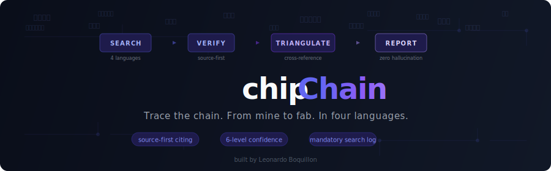

<p align="center">
  
</p>

<p align="center">
  <a href="LICENSE"></a>
  
  
  
</p>

# chipchain

> *The most opaque supply chain on earth, decoded.*

A multilingual AI research skill that investigates semiconductor supplier relationships, material chokepoints, and market structure across Korea, Japan, Taiwan, and China. It searches regulatory filings in Korean, queries patent databases in Japanese, reads IPO prospectuses in Chinese, and triangulates findings across multiple independent sources before making a single claim. No guessing. No hallucinations. Just sources.

**One question. Four languages. Dozens of sources. 80 seconds.**

Built for [Claude Code](https://claude.ai/code) and [OpenClaw](https://openclaw.ai). Compatible with the [Agent Skills](https://agentskills.io) open standard. Also available on [ClawHub](https://clawhub.ai/lboquillon/chipchain).

## Who This Is For

Equity analysts researching semiconductor supplier relationships for TSMC, Samsung, SK Hynix, and their tier-2 material vendors. Policy researchers tracking export controls, supply chain chokepoints, and localization drives across East Asia. Procurement and supply chain teams mapping material dependencies beyond tier-1, where the real concentration risks hide. OSINT researchers who need to search Korean DART filings, Japanese EDINET reports, Chinese IPO prospectuses, and Taiwanese MOPS disclosures in the original language. Anyone who has tried to Google Translate semiconductor industry terms and gotten useless results.

## Table of Contents

- [Who This Is For](#who-this-is-for)
- [Why This Exists](#why-this-exists)
- [What It Produces](#what-it-produces)
- [Google Translate Will Fail You Here](#google-translate-will-fail-you-here)
- [How It Stays Honest](#how-it-stays-honest)
- [What's Inside](#whats-inside)
- [Query Types](#query-types)
- [Installation](#installation)
- [Roadmap](#roadmap)
- [Contributing](#contributing)

---

## Why This Exists

Everyone knows TSMC, ASML, Samsung. Ask a harder question:

> *"Who supplies the hafnium precursor chemicals that go into SK Hynix's high-k dielectric deposition process?"*

And you've fallen off the English-language internet entirely.

That answer lives in a [DART filing](https://dart.fss.or.kr) in Korean, under the section header `주요 거래처`. Or in a Japanese company's [EDINET annual report](https://disclosure2.edinet-fsa.go.jp), in the `主要仕入先` section. Or in a Chinese STAR Market IPO prospectus on [cninfo](https://cninfo.com.cn), in the `前五名供应商采购额` disclosure. Or mentioned once in an [ET News](https://etnews.com) article that used the term `프리커서`, which is the actual industry loanword for "precursor" in Korean semiconductor press. Google Translate would give you `전구체`, and that would return completely different search results.

**chipchain knows where to look, what to search for, and which term to use in which language.** Your analyst doesn't speak Korean, Japanese, and Chinese. This one does.

---

## What It Produces

Real investigations. Real sources. Real confidence grades.

### Investigation 1: "Who supplies electronic-grade HF to Samsung's Pyeongtaek fab?"

Three parallel research agents. Korean, Japanese, and English searches running simultaneously. **80 seconds.** Try doing that with a human analyst team.

**What it found:**
- **6 suppliers identified**: Soulbrain, ENF Technology, Wonick Materials, Stella Chemifa, Morita Chemical, Foosung
- **The complete pre-2019 vs post-2019 supply chain restructuring**: how Japan's export restrictions permanently shifted Samsung's HF sourcing from Japanese to Korean domestic suppliers
- **Korean imports of Japanese HF fell 87.6%** from 2018 to 2022, sourced from a real article accessed in the session
- **12+ specific sources cited**: 피치원미디어, 녹색경제신문, BusinessKorea, ZDNet Korea, Nikkei, ET News, The Worldfolio, Kabutan
- Soulbrain labeled **CONFIRMED** (multiple independent Korean press sources). Stella Chemifa's pre-2019 role labeled **STRONG INFERENCE** (Nikkei + revenue geography, but no direct Samsung confirmation found)
- A "What I Could Not Verify" section listing 6 specific gaps, and 4 actionable next steps (specific DART filing queries, Comtrade HS codes, EDINET codes)

*Result: supply chain map with sourced confidence levels*


*What it could not verify: honest gaps, failed searches, and actionable next steps*


### Investigation 2: "If China restricts fluorspar exports, what's the downstream impact?"

Full scenario analysis. Multiple agents. Trade data, corporate filings, defense think tank reports.

**What it found:**
- The complete **fluorine cascade**: fluorspar → HF → NF₃ + WF₆ + CF₄ + C₄F₈ + SF₆ + fluoropolymers + LiPF₆ (EV battery competition for the same feedstock)
- **Stella Chemifa operates Chinese JV subsidiaries** (Zhejiang Blue Star Chemical, Quzhou BDX) specifically to secure fluorspar, discovered via live search
- **IDA Document D-5379** modeling a 71,847 metric ton fluorspar shortfall in a military conflict scenario
- **China's own reserves are depleting**: 11.75 year reserve-to-production ratio vs. 31.82 global average. China is becoming a net *importer* from Mongolia
- **Koura/Sojitz building a Mexican-fluorspar-sourced HF plant in Fukuoka**, the first non-China-sourced HF plant in Japan
- Country-by-country exposure assessment, alternative supply evaluation, and a week-by-week impact timeline through year 3

---

## Google Translate Will Fail You Here

English-language research covers maybe 20% of the semiconductor supply chain. The rest lives behind language barriers that machine translation can't cross, because machine translation has no idea how semiconductor engineers actually talk.

### The Problem

If you Google Translate "etch" into Korean, you get `에칭`. Korean semiconductor engineers and industry press use `식각`, a Sino-Korean term. Search for `에칭` on ET News and you get noise. Search for `식각` and you get every article about Samsung's etch process development.

If you Google Translate "supplier" into Japanese, you might get `サプライヤー`. EDINET financial filings, the documents that legally disclose who supplies whom, use `仕入先`. Miss that term, miss the data.

If you're researching photoresists in Chinese, you need to know that mainland China says `光刻胶` while Taiwan says `光阻`. Completely different words. Search the wrong one and you're looking at the wrong country's supply chain.

### What This Skill Knows

**280+ industry-specific term mappings** across Korean, Japanese, Simplified Chinese, and Traditional Chinese. These are the actual terms used in regulatory filings, industry press, patent documents, and corporate disclosures.

#### Korean (한국어): Where Textbook Korean Falls Apart

| What Google gives you | What the industry actually uses | Why it matters |
|---|---|---|
| 에칭 (etching) | **식각** | Every ET News article, every DART filing uses 식각 |
| 디포지션 (deposition) | **증착** | Universal in Korean semiconductor press |
| 익스포저 (exposure) | **노광** | The standard lithography term |
| 재료 (material) | **소재** | In supply chain context, 소재 is dominant |
| 회사 (company) | **업체** | Industry press default |

Plus terms that have no English equivalent:
- **소부장** (소재+부품+장비): the abbreviation for "materials/parts/equipment" that shows up in every Korean semiconductor policy document since 2019
- **국산화**: "localization/domestication," THE search term for tracking Korea's push to replace Japanese suppliers
- **탈일본**: literally "de-Japan," the 2019-2020 buzzword for import substitution

#### Japanese (日本語): The Mixed-Script Maze

Japanese semiconductor language uses a distinctive mix of kanji, katakana, and raw English acronyms. The pattern is specific:

| Category | What's used | Example |
|---|---|---|
| Process acronyms | English | ALD, CVD, CMP, EUV (never translated) |
| Traditional chemistry | Kanji | フッ酸 (HF), 過酸化水素 (H₂O₂) |
| Newer concepts | Katakana | フォトレジスト, エッチング |
| Business/filing terms | Kanji | 仕入先 (supplier), 歩留まり (yield) |

Critical spelling trap: **Silicon wafer = ウェーハ**, not ウエハー. Both Shin-Etsu and SUMCO use ウェーハ. Search with the wrong spelling and you get zero results.

EDINET filings use `主要仕入先` (major suppliers) to reveal supplier relationships. Industry press uses the katakana loanword `サプライヤー`. Different term, different context, different search strategy.

#### Chinese: Same Industry, Two Dictionaries

Eleven critical terms are completely different words between mainland China and Taiwan:

| Concept | Mainland (简体) | Taiwan (繁體) | Impact |
|---|---|---|---|
| Silicon | **硅** (gui) | **矽** (xi) | Cascades through hundreds of compound terms |
| Chip | **芯片** | **晶片** | Different word entirely |
| Photoresist | **光刻胶** | **光阻** | Different word entirely |
| Lithography | **光刻** | **微影** | Different word entirely |
| Etch | **刻蚀** | **蝕刻** | Same characters, reversed order |
| Epitaxial | **外延** | **磊晶** | Different word |
| Plasma | **等离子体** | **電漿** | Different word |
| Nanometer | **纳米** | **奈米** | Different word |
| Process node | **工艺** | **製程** | Different word |
| Integrated circuit | **集成电路** | **積體電路** | Different word |
| IP core | **IP核** | **矽智財** | Completely different concept framing |

China-specific policy vocabulary unlocks an entire research dimension:
- **卡脖子** (qia bozi, "strangled at the neck"): the ubiquitous metaphor for technology chokepoints. Search `卡脖子 半导体` and you find every Chinese article about semiconductor supply chain vulnerabilities
- **国产替代**: "domestic substitution," tracks China's progress replacing foreign suppliers
- **大基金**: "Big Fund," the national semiconductor investment vehicle

### Where to Find Supplier Disclosures, by Country

| Country | Filing System | Section that reveals suppliers |
|---|---|---|
| Korea | DART (dart.fss.or.kr) | `주요 거래처` (major trading partners), `원재료 매입 현황` (raw material purchases) |
| Japan | EDINET | `主要仕入先` (major suppliers), `主要販売先` (major customers >10% revenue) |
| Taiwan | MOPS (mops.twse.com.tw) | `主要供應商` (major suppliers), `前十大供應商` (top-10 suppliers) |
| China | cninfo (cninfo.com.cn) | `前五名供应商采购额` (top-5 supplier procurement amounts) |

Chinese STAR Market IPO prospectuses (`招股说明书`) disclose top-5 suppliers **by name with dollar amounts**. This is the richest public source for Chinese semiconductor supply chain mapping, and almost nobody outside China knows it exists.

---

## How It Stays Honest

Semiconductor supply chain intelligence is useless if it's wrong. A confident fabrication is worse than no answer. An investor acting on a hallucinated supplier relationship can lose real money. A policy analyst citing a fabricated filing reference destroys their credibility.

### Why This Needs Its Own Protocol

LLMs hallucinate. They fabricate plausible supplier relationships, invent filing references, and present training knowledge as freshly researched fact. The most dangerous hallucination isn't the obviously wrong one. It's the one that sounds exactly right because there's no source you can check.

### Six-Level Confidence System

Every finding is graded by **how it was obtained**, with source date:

| Level | What it means | Example |
|---|---|---|
| **CONFIRMED (YYYY)** | Source accessed THIS session, with year | "DART filing 2024, section 주요 거래처 names Company X" |
| **STRONG INFERENCE** | 2+ independent signals, THIS session | "Patent co-filing + supplier award + revenue geography" |
| **MODERATE INFERENCE** | 1 indirect signal, THIS session | "Conference co-authorship only" |
| **SPECULATIVE** | Logical deduction | "Only 3 companies globally produce this" |
| **FROM SKILL DATABASE** | Entity files, not verified today | "entities/korea.md lists Company X" |
| **FROM TRAINING KNOWLEDGE** | LLM memory, lowest reliability | "I recall Company Y is in this space" |

**CONFIRMED (2025 source)** has higher trust than **CONFIRMED (2020 source)**. The year qualifier prevents stale data from masquerading as fresh intelligence.

### Six Hard Rules

| # | Rule | Why |
|---|---|---|
| 1 | **NEVER say "according to DART filing" unless you actually fetched it** | "According to" implies access. If you didn't access it, you're lying. |
| 2 | **NEVER fabricate a URL, filing number, or patent number** | Say "search for X on Y" instead of inventing a reference. |
| 3 | **NEVER present entity database info as confirmed current fact** | "Listed as a supplier" ≠ "supplies." The database is a hypothesis. |
| 4 | **NEVER fill gaps with plausible guesses** | An honest "I don't know" beats a confident fabrication every time. |
| 5 | **NEVER round-trip training knowledge through skill files** | Reading your own database doesn't verify anything. |
| 6 | **NEVER claim to have searched something you didn't** | Failed searches are information. Report them. |

### "Making ≠ Supplying"

The single most common hallucination in supply chain analysis:

> "Company X makes hafnium precursors" ≠ "Company X supplies hafnium precursors to SK Hynix"

Manufacturing a material and supplying it to a specific customer require completely different evidence. The skill enforces this distinction at every step.

### Source-First Citation

The most important structural anti-hallucination rule: **write the source tag BEFORE the claim, not after.**

```markdown
## Wrong (post-hoc — easy to fabricate)
Soulbrain is Samsung's primary HF supplier [CONFIRMED]

## Right (source-first — forces evidence before claim)
[FOUND: 피치원미디어 2024-03-15] → Soulbrain is Samsung's primary HF supplier
```

If you can't write the `[SOURCE]` tag, you don't have evidence. The claim doesn't belong in the report.

### Mandatory Search Log

Every report includes a full log of what was searched, in what language, and what came back — including failed searches. This makes the investigation auditable and prevents the agent from claiming searches it never performed.

```markdown
| # | Query | Language | Source | Result |
|---|---|---|---|---|
| 1 | "삼성전자 불산 공급업체" | KO | ET News | 3 relevant articles |
| 2 | "ステラケミファ 主要販売先" | JA | WebSearch | Paywalled, snippet only |
| 3 | DART 솔브레인 사업보고서 | KO | OpenDART | Filing not accessible |
```

A researcher who shows their work — including dead ends — is more useful than one who only presents conclusions.

### In Practice

From the HF supplier investigation:
- `[FOUND: 피치원미디어, BusinessKorea, ZDNet Korea]` → Soulbrain: **CONFIRMED (2024 sources)** as Samsung's primary HF supplier
- `[FOUND: Nikkei + revenue geography]` → Stella Chemifa pre-2019: **STRONG INFERENCE**, no direct Samsung confirmation found
- 6 specific things it **could not verify**, honestly listed
- 4 **actionable next steps**: specific DART queries, Comtrade HS codes, EDINET filing codes

No fabricated filing numbers. No invented URLs. No confident guesses dressed up as research.

---

## What's Inside

### The Investigation Pipeline

```
User Question
    │
    ▼
┌─────────────────────────────┐
│  1. CLASSIFY                │  Supplier ID? Bottleneck? Scenario?
│     Route to workflow       │  Change detection? Reverse lookup?
└──────────┬──────────────────┘
           ▼
┌─────────────────────────────┐
│  2. LOAD CONTEXT            │  Only files needed for THIS question
│     Lexicon + Entities +    │  Korean question? → ko.md + korea.md
│     Sources for the region  │  Japan materials? → ja.md + japan.md
└──────────┬──────────────────┘
           ▼
┌─────────────────────────────┐
│  3. MULTI-AGENT RESEARCH    │  Parallel sub-agents:
│     3-4 languages           │  - Filing search (DART/EDINET/MOPS/cninfo)
│     simultaneously          │  - Industry press (ET News/DigiTimes/JiWei)
│                             │  - Patent/academic co-filing
│                             │  - Trade data (Comtrade/e-Stat)
└──────────┬──────────────────┘
           ▼
┌─────────────────────────────┐
│  4. TRIANGULATE             │  Patent co-filing + revenue geography +
│     Multiple signals        │  supplier award + conference co-authorship
│     required                │  + trade data + chemical registrations
└──────────┬──────────────────┘
           ▼
┌─────────────────────────────┐
│  5. REPORT                  │  CONFIRMED → STRONG INFERENCE →
│     Grade every claim       │  MODERATE → SPECULATIVE →
│     Source everything       │  SKILL DATABASE → TRAINING KNOWLEDGE
│     Flag every gap          │  + "What I Could Not Verify"
└─────────────────────────────┘
```

### Skill Contents

- **200+ companies** across `entities/` files (Korea, Japan, Taiwan, China) with tickers, products, and native-script names. The invisible tier-2/tier-3 suppliers live here: Toyo Gosei (~60-70% of photoacid generators), Fuso Chemical (colloidal silica monopoly), and Ajinomoto Fine-Techno (~100% of ABF substrate film, a food company's subsidiary that every Intel/AMD/Nvidia chip depends on)
- **7 chemistry chains** in `chemistry/precursor-chains.md` tracing materials from fab all the way down to the mine: photoresist, hafnium precursors, electronic-grade HF, NF₃, silicon wafers (all the way to Spruce Pine, NC quartz), CMP slurry, and sputtering targets. Chokepoints identified at every tier
- **10 global chokepoints**, all Japanese, with approximate market share estimates (~2023-2024, labeled as unverified)
- **7 investigative workflows** in `queries/`, each with multilingual search templates across all four languages. Includes an 8-step chemistry chain tracing methodology (`queries/chemistry-chain.md`) with CAS lookups and chemical registration DB searches, and a market sizing pipeline (`queries/market-sizing.md`) with top-down/bottom-up cross-checks
- **HS codes** in `trade/hs-codes.md` for tracking bilateral semiconductor material flows (silicon wafers 3818, photoresists 3707, equipment 8486, HF 2811.11, fluorspar 2529.21)
- **Patent co-filing analysis** guide in `academia/patents-guide.md` with CPC classification codes, co-assignee detection methodology, and guides to KIPRIS, J-PlatPat, CNIPA, Google Patents, Lens.org
- **University-industry signals** in `academia/universities.md`: SKKU co-publications signal Samsung R&D, NYCU signals TSMC, Tohoku signals TEL/Kioxia
- **Geopolitical context** in `geopolitical.md` covering export control regimes (US-China Oct 2022+, Japan July 2023, Japan-Korea 2019), localization drives (Korea 소부장, China 国产替代, Japan Rapidus/JASM)
- **Free broker research aggregators** in `finance/broker-sources.md`: Naver Finance (Korea), EastMoney (China), Kabutan (Japan), MOPS (Taiwan)
- **SEMICON exhibitor databases**, publicly searchable directories that categorize every supply chain participant by product type. The exhibitor list IS the supply chain map

The skill queries APIs programmatically where possible (Comtrade, OpenDART, e-Stat, KIPRIS, Lens.org, PubChem) and falls back to WebSearch for sources without API access (EDINET, industry press, chemical registration databases). See `sources.md` for full details.

The agent cross-pollinates findings across languages (a Japanese filing result feeds into Korean press searches), checkpoints with the user before going deep, and offers to execute recommended next steps rather than leaving them as static text.

### Verification Log System

Entity files (`entities/*.md`) now include a **Verification Log**, a running record of claims that have been confirmed through actual investigations. Entries start as unverified hypotheses from training knowledge. When an investigation confirms a claim with sources accessed in that session, it gets logged with the date, sources, and investigation name.

Entity file trust accumulates over time. After the Samsung HF supplier investigation, Soulbrain's entry is now backed by 피치원미디어, BusinessKorea, ZDNet Korea, and 녹색경제신문, not just training knowledge.

```markdown
## Verification Log
| Company | Claim Verified | Date | Sources | Investigation |
|---|---|---|---|---|
| Soulbrain | Samsung Pyeongtaek primary HF supplier (post-2019) | 2026-03-13 | 피치원미디어, BusinessKorea, ZDNet Korea | HF supplier ID |
```

---

## Query Types

| Type | Example | What it does |
|---|---|---|
| **Supplier ID** | "Who supplies hafnium precursors to SK Hynix?" | Multi-language filing + press + patent search |
| **Bottleneck** | "Where's the chokepoint in EUV pellicles?" | Concentration risk with substitutability assessment |
| **Change Detection** | "What shifted in Korea's photoresist supply?" | Before/after with localization progress tracking |
| **Reverse Lookup** | "What does LK Chem actually do?" | Places unknown company in the supply chain taxonomy |
| **Scenario Analysis** | "If China restricts fluorspar, what breaks?" | Full cascade with timeline and exposure matrix |
| **Chemistry Chain** | "Trace hafnium from mine to fab" | 8-step tier-by-tier tracing with CAS lookups, chemical registration DBs, patent validation |
| **Market Sizing** | "What's the CMP slurry market breakdown?" | Top-down analyst + bottom-up filings + trade data cross-check with concentration analysis |

---

## Installation

### Prerequisites

- [Claude Code](https://claude.ai/code) or [OpenClaw](https://openclaw.ai)
- Git
- Python 3.10+ (only needed for running the verification scripts in `scripts/`)

### Quick Start (macOS/Linux)

```bash
git clone https://github.com/lboquillon/chipchain.git
mkdir -p ~/.claude/skills
ln -sfn "$(pwd)/chipchain" ~/.claude/skills/chipchain
claude
```

Then ask: `/chipchain Who supplies CMP slurry to TSMC?`

### Claude Code

**macOS / Linux:**

```bash
git clone https://github.com/lboquillon/chipchain.git
mkdir -p ~/.claude/skills
ln -sfn "$(pwd)/chipchain" ~/.claude/skills/chipchain
claude  # start a new session
```

**Windows (PowerShell as Administrator):**

```powershell
git clone https://github.com/lboquillon/chipchain.git
New-Item -ItemType Directory -Path "$env:USERPROFILE\.claude\skills" -Force | Out-Null
New-Item -ItemType SymbolicLink -Path "$env:USERPROFILE\.claude\skills\chipchain" -Target "$(Get-Location)\chip-chain"
claude  # start a new session
```

**Windows (CMD as Administrator):**

```cmd
git clone https://github.com/lboquillon/chipchain.git
if not exist "%USERPROFILE%\.claude\skills" mkdir "%USERPROFILE%\.claude\skills"
mklink /D "%USERPROFILE%\.claude\skills\chipchain" "%CD%\chip-chain"
claude
```

> **Note:** Windows symlinks require Administrator privileges, or Developer Mode enabled in Settings > For Developers.

```
/chipchain Who supplies CMP slurry to TSMC?
```

Or just ask naturally — the skill triggers on semiconductor supply chain questions automatically.

**Try these:**
- `Who supplies photoacid generators for EUV resist?`
- `If China restricts fluorspar exports, what breaks?`
- `Trace hafnium from mine to TSMC's fab`
- `What's the CMP slurry market breakdown?`
- `What does Toyo Gosei actually make and why does it matter?`

### OpenClaw

```bash
git clone https://github.com/lboquillon/chipchain.git \
  ~/.openclaw/skills/chipchain
```

---

## Roadmap

### Filing Parsers: From "Here's Where to Look" to "Here's the Data"

The skill currently tells you *where* to look in regulatory filings and *which section headers* to search for. Next step: code that actually extracts and structures the data programmatically.

**The problem:** DART filings have structured APIs. Chinese cninfo filings are downloadable PDFs with standardized section layouts. Taiwan MOPS has structured HTML. EDINET (Japan) requires a Subscription-Key for API access and the viewer site (GeneXus framework) can't be scraped because filings are rendered entirely via JavaScript. For now the skill gives you search strategies and section names, but you still have to read the output yourself.

**What we're building:** Python parsers (in `scripts/`) for each filing system that:
1. Download a filing by company code
2. Extract the supply-chain-relevant sections (주요 거래처, 前五名供应商, 主要供應商)
3. Output structured JSON with company names, percentages, amounts, and dates

**Planned targets (in order):**

| Filing System | Format | Difficulty | Why this order |
|---|---|---|---|
| **OpenDART** (Korea) | JSON API + HTML | Medium | Free API key. 주요 거래처 and 원재료 매입 현황 sections are semi-structured |
| **cninfo** (China) | PDF + HTML | Hard | STAR Market IPO prospectuses (招股说明书) with 前五名供应商采购额, the richest source but PDF extraction is a pain |
| **MOPS** (Taiwan) | HTML | Medium | Monthly revenue (月營收) is structured HTML. Supplier sections (主要供應商) often anonymized |

**EDINET (Japan) limitations:** The EDINET API requires a Subscription-Key (free but requires registration). The EDINET viewer website runs on GeneXus, a framework that renders all content via JavaScript, which makes it impossible to scrape with standard HTTP requests. For Japanese filings, the agent uses WebSearch with company names + filing section terms (e.g., `"信越化学工業" 有価証券報告書 主要仕入先`). EDINET codes for key semiconductor companies are maintained in `sources.md` as search aids.

This turns the skill from "here's how to investigate" into "here's the data, already extracted."

---

## Contributing

**Add a company:** Edit `entities/*.md`. Include name (English + native script), ticker, products, confidence level.

**Fix a term:** Edit `lexicon/*.md`. Verify against actual industry press (ET News, The Elec, DigiTimes, EE Times Japan), not dictionary translation.

**Add a source:** Edit `sources.md`. Include URL, language, access method, and a working curl example.

---

## License

MIT

---

*The semiconductor industry doesn't have a data problem. It has a language problem, a filing-format problem, and a "knowing where to look" problem. chipchain solves all three.*

*Built by [Leonardo Boquillon](https://leoinai.substack.com). Contributions welcome.*

---

## Related Projects

chipchain is part of a broader semiconductor supply chain intelligence effort built around [Investmap](https://investmap.cc):

- **[Investmap Supply Chain Network](https://investmap.cc/network)** — Interactive network graph tracing supplier relationships between semiconductor companies. Visualize who supplies what to whom across the entire chain.
- **[How Chips Are Made](https://investmap.cc/steps)** — Step-by-step visual guide to the semiconductor manufacturing process, from wafer fabrication to packaging and test.
- **[Company Directory](https://investmap.cc/companies)** — Searchable directory of semiconductor supply chain companies with products, tickers, and supply chain positioning.
- **[Leo in AI (Substack)](https://leoinai.substack.com)** — Writing about AI, semiconductor supply chains, and the tools being built to make them transparent.